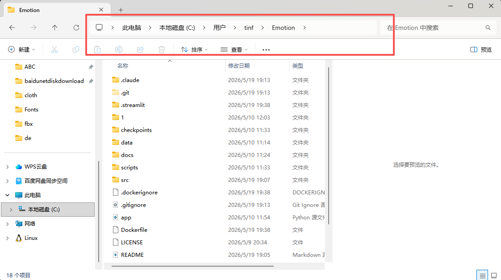
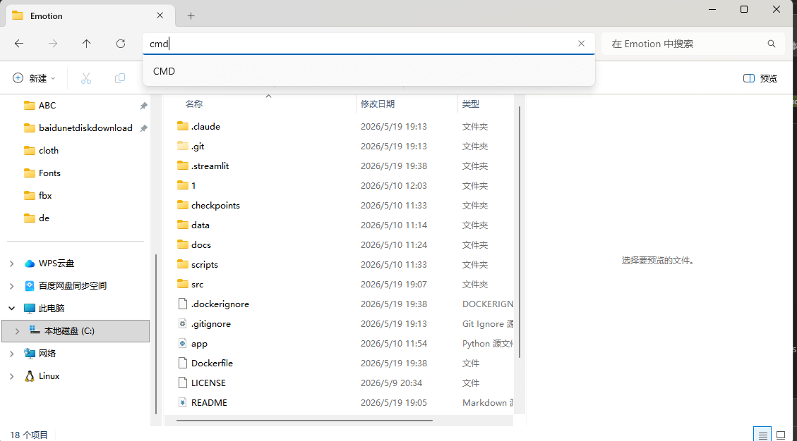
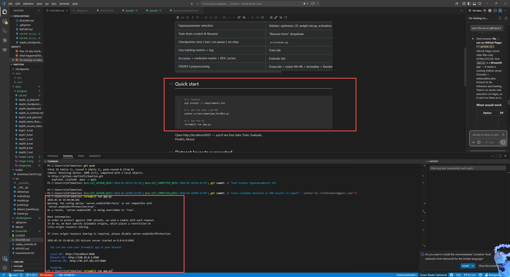
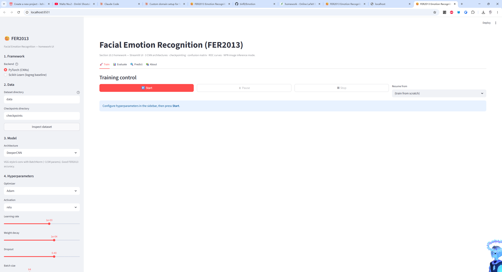
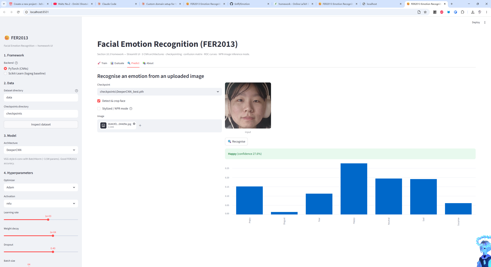

## 前期准备

### 安装 vscode

https://code.visualstudio.com/

### 安装 steam++

https://steampp.net/

网页搜索github进入

登录

Xu:
tinfDreemurr@gmail.com

Cen:
2qmhsll@gmail.com

密码均为:zzg653wzn
（其实你们任选一个都可以账号都可以）

在本地respo里面可以看到项目emotion, 以及从5.9-19日的git记录

## 本地运行

按win+R, 输入cmd

输入

`git clone https://github.com/tinfll/Emotion.git`

code .

如果依然有网络问题下载百度网盘链接到文件夹
然后在该文件夹目录下cmd: code .

ctrl+点击下面任意网址跳转

debug:
按照 [README.md](../../README.md) 里中依次输入，可以部署py环境后本地运行
（环境配置有问题直接问就好，这块我比较擅长（...泪））

但是具体项目结构，有无瑕疵，和老师上课说的等等都直接说就好，因为我也确实完全不知道是否存在班门弄斧等其他情况，

对这块技术栈不了解

简单测试

报告:(第一版，若需修改直接提出即可！)

[/homeworkCN.pdf](homeworkCN.pdf)
https://www.overleaf.com/3467427858dzjyzyzmhgww#7e65e5

可在线编辑，latex报告

release:
暂无，
